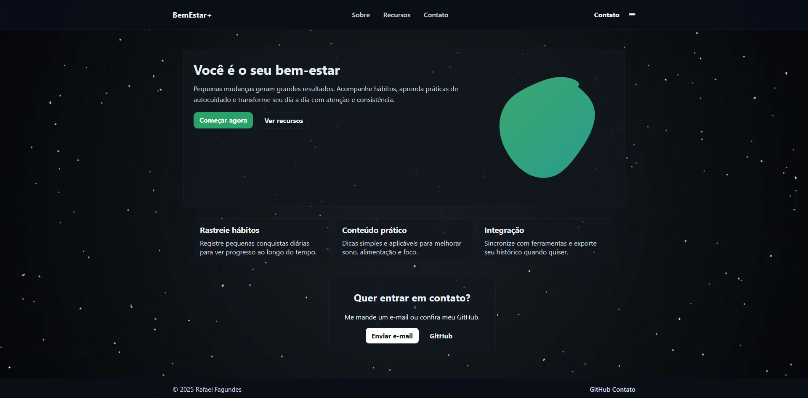

# BemEstar



BemEstar é uma aplicação fullstack com Javascript e Typescript para servir de base para uma plataforma de promoção à saúde, atuando como ponte entre usuários e profissionais da área. O foco é fornecer endpoints robustos e escaláveis para autenticação com token e refreshToken, cadastro por confirmação de email, gerenciamento de usuários, profissionais e funcionalidades relacionadas ao bem-estar físico e mental.

## Estrutura do Projeto
- **dist/** - Código transpilado para js
- **src/**
   - **controllers/** — Lógica dos endpoints e orquestração das regras de negócio.
   - **models/** — Modelos de dados utilizados pela aplicação, integrados ao banco de dados.
   - **routes/** — Definição das rotas da API, agrupando endpoints por domínio (usuários, profissionais, etc).
   - **middlewares/** — Middlewares customizados para autenticação, validação e tratamento de erros.
   - **helpers/** — Funções utilitárias utilizadas em diferentes partes do projeto.
   - **database/** — Configurações, scripts e conexões com o banco de dados.
   - **server.js** — Ponto de entrada principal da aplicação, carregando middlewares, rotas e inicializando o servidor.
- **views/** — Templates de visualização (caso aplicável).
- **public/** — Arquivos estáticos (se necessário).
- **tests/** - Arquivos para testes unitários e de integração
## Tecnologias e Ferramentas Utilizadas

- **Node.js** — Ambiente de execução JavaScript para backend.
- **Express** — Framework web para criação das rotas e middlewares.
- **Mongoose** — ODM para integração com MongoDB.
- **MongoDB** — Banco de dados NoSQL utilizado para persistência.
- **JWT (jsonwebtoken)** — Autenticação baseada em tokens.
- **bcrypt** — Criptografia de senhas.
- **cookie-parser** — Parser de cookies nas requisições.
- **cors** — Controle de compartilhamento de recursos entre origens.
- **cron** — Limpar conjuntos expirados no banco de dados
- **express-rate-limit** — Limitar chamadas chamadas sucessivas 
- **EJS** — Motor de templates para views (se aplicável).

## Instalação e Uso

1. Clone o repositório:
   ```bash
   git clone https://github.com/devRafaelFagundes/BemEstar.git
   cd BemEstar
   ```
2. Instale as dependências:
   ```bash
   npm install
   ```
3. Configure as variáveis de ambiente em um arquivo `.env` conforme necessário.
4. Inicie o servidor:
   ```bash
   npm start
   ```
   O servidor rodará por padrão em `http://localhost:3000`.

## Scripts

- `npm start` — Inicia o servidor em produção.
- `npm run dev` — Inicia o servidor em modo desenvolvimento (se configurado).

## Endpoints Principais

Veja as rotas detalhadas na pasta [`routes/`](./routes).

## Contribuição

Pull requests são bem-vindos! Siga o padrão de organização de pastas e mantenha a separação de responsabilidades (controller, model, routes, etc).

1. Faça um fork do projeto
2. Crie sua branch (`git checkout -b feature/nome-feature`)
3. Commit suas alterações (`git commit -am 'feat: minha feature'`)
4. Push para o branch (`git push origin feature/nome-feature`)
5. Abra um Pull Request

## Licença

MIT

---
Desenvolvido por [devRafaelFagundes](https://github.com/devRafaelFagundes)
